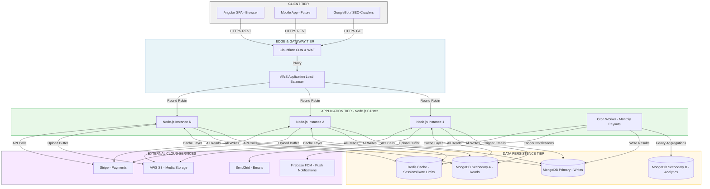
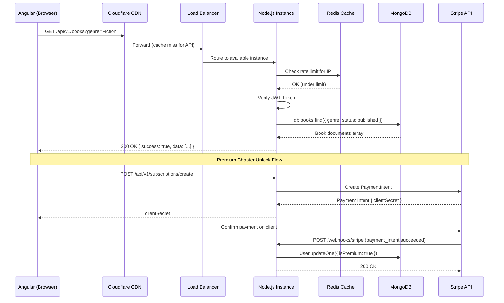
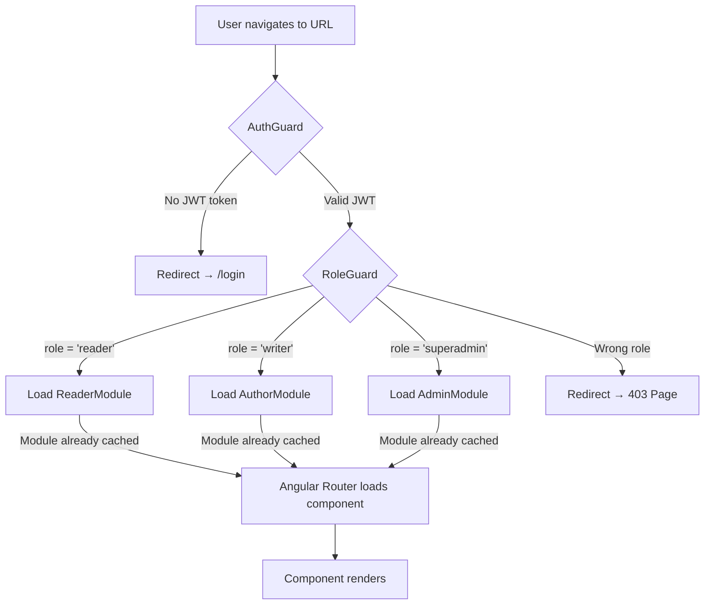
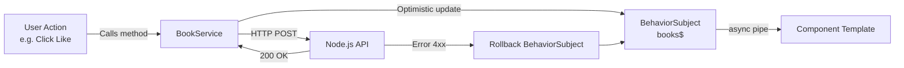
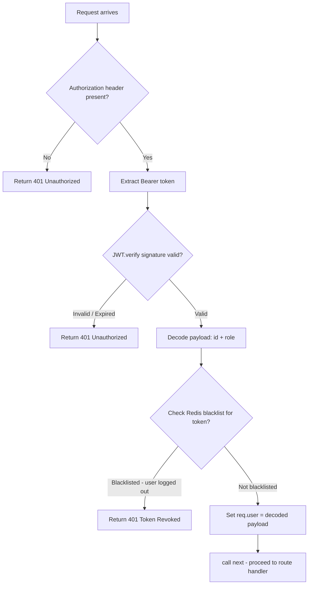
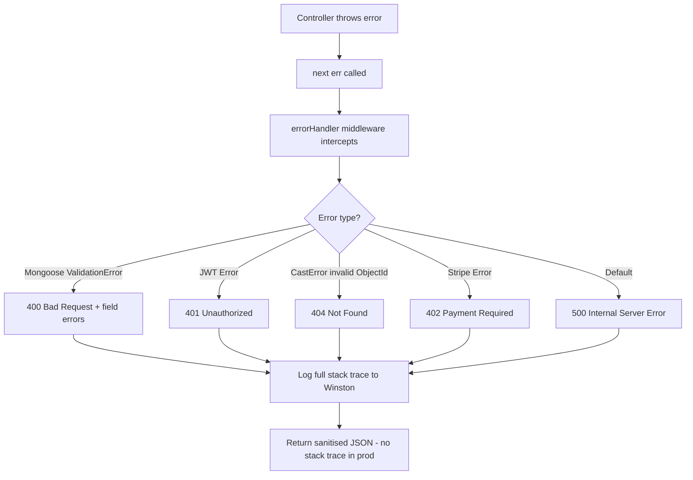
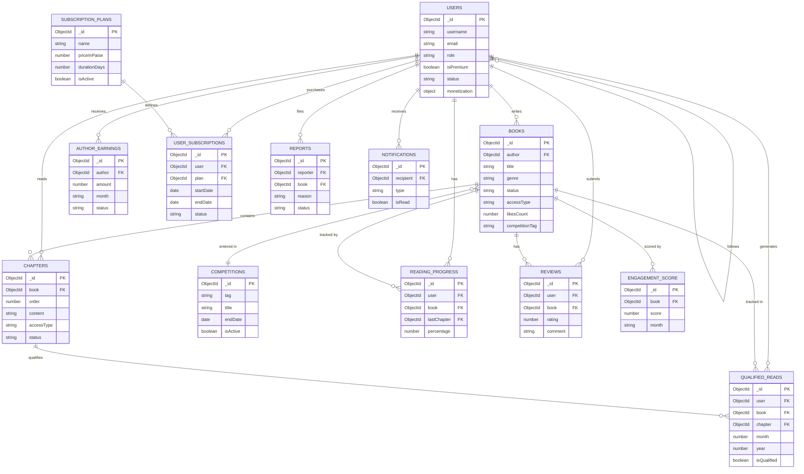
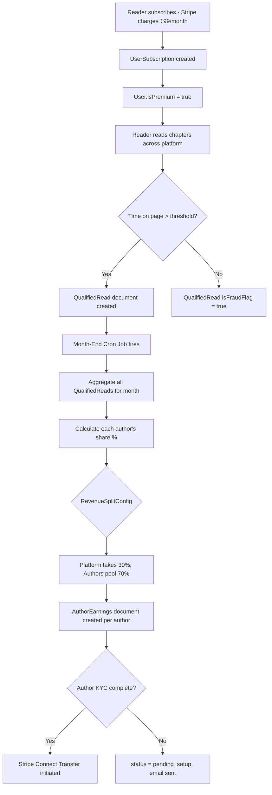

# Mozhibu - Story Platform
## Comprehensive Technical Documentation

**Version:** 2.0  
**Date:** September 2026  
**Classification:** Technical Reference Document  
**Prepared For:** Client Stakeholders & Development Teams

---

# Table of Contents

1. [Executive Project Overview](#1-executive-project-overview)
2. [Technologies Used](#2-technologies-used)
3. [System Architecture Diagram](#3-system-architecture-diagram)
4. [Frontend Application Architecture](#4-frontend-application-architecture)
5. [Backend & Middleware Architecture](#5-backend--middleware-architecture)
6. [Database Schema & Data Models](#6-database-schema--data-models)
7. [Entity Relationship Diagram (ER Diagram)](#7-entity-relationship-diagram)
8. [API Architecture & Routing](#8-api-architecture--routing)
9. [Test Case Documentation](#9-test-case-documentation)

---

# 1. Executive Project Overview

## 1.1 Introduction

**Mozhibu - Story** is a multilingual, full-stack digital storytelling and literary platform designed to bridge the gap between independent authors and readers across diverse linguistic communities. The name *Mozhibu* is derived from the Tamil word for *language*, reflecting the platform's foundational mission: celebrating linguistic diversity through original literature.

The platform is not a simple blog or content aggregator. It is a comprehensive literary economy — a sophisticated, real-time system where authors write, publish, and earn revenue directly from their readership; where readers discover, follow, and immerse themselves in serialised fiction; and where competitions drive engagement and accelerate discoverability for talented new voices.

## 1.2 Mission Statement

> *To democratise global storytelling by providing a robust, equitable, and technologically superior platform where linguistic diversity is celebrated, raw creativity is financially rewarded, and the act of reading is elevated through seamless technology.*

## 1.3 Platform Scope & Core Capabilities

| Module | Description | Primary Actors |
|--------|-------------|----------------|
| **Author Studio** | A full-featured writing interface for creating, editing, and publishing serialised books and chapters with cover uploads, genre tagging, and analytics. | Writers |
| **Reader Interface** | An immersive, distraction-free reading UI with customisable typography, dark/light themes, offline caching, and cross-device progress synchronisation. | Readers |
| **Subscription Engine** | A Stripe-integrated dual-tier monetisation system where readers subscribe for premium access and authors earn proportional revenue based on Qualified Reads. | Readers, Writers |
| **Competitions Module** | Time-bound, admin-configured writing contests with eligibility checking, real-time leaderboards, and winner selection. | Admins, Writers |
| **Monetisation & Payouts** | An end-of-month automated Cron Job that calculates each author's revenue share from the subscription pool and transfers earnings via Stripe Connect. | Writers, Admins |
| **Admin Control Panel** | A secure moderation dashboard for managing user accounts, reviewing reported books, approving author applications, and configuring system-wide parameters. | Superadmins |
| **Notification System** | A push-notification and in-app alert engine via Firebase Cloud Messaging (FCM) for chapter releases, competition results, and moderation events. | All Users |

## 1.4 User Roles & Permissions

```
┌─────────────────────────────────────────────────────────────────┐
│                        ROLE HIERARCHY                           │
├─────────────────────────────────────────────────────────────────┤
│                                                                  │
│   [SUPERADMIN]  ──── Full system access, manage all users       │
│         │             and platform config                        │
│         │                                                        │
│   [WRITER]      ──── All Reader permissions + Author Studio     │
│         │             publish books, earn payouts                │
│         │                                                        │
│   [READER]      ──── Browse books, read chapters, subscribe     │
│                       follow authors, leave reviews             │
│                                                                  │
└─────────────────────────────────────────────────────────────────┘
```

### Role Progression
- A user registers as a **Reader** by default.
- A Reader submits an **Author Request** (with pen name and bio).
- A **Superadmin** approves the request, upgrading their role to **Writer**.
- Writers can receive payouts once their **KYC (bank details)** are submitted and verified.

## 1.5 User Journey Maps

### Journey A — Reader Lifecycle
```
1. LANDING        User discovers the platform via SEO link or social share
        │
2. ONBOARDING     User signs up via email/password or OAuth (Google/Facebook)
        │         Selects preferred language and favourite genres
        │
3. DISCOVERY      Personalised feed shows books matching genres
        │         User follows authors, bookmarks books
        │
4. READING        Opens chapters, progress is tracked every 60 seconds
        │         Heartbeat API updates ReadingProgress document
        │
5. PAYWALL        Chapter 10 is Premium — upgrade modal appears
        │         User inputs card → Stripe processes → webhook fires
        │
6. PREMIUM        isPremium = true, all locked chapters unlock instantly
```

### Journey B — Writer Earning Pipeline
```
1. APPLICATION    Reader submits AuthorRequest → Admin approves
        │
2. CREATION       Writer creates Book with cover art and genre tags
        │         Drafts Chapter 1 in the rich text editor
        │
3. PUBLICATION    Publishes chapter → FCM notification sent to all followers
        │
4. KYC SETUP      Writer submits encrypted bank details (accountNumber, IFSC)
        │
5. MONTH END      Cron Job aggregates all QualifiedReads for the author's books
        │         Calculates revenue share from total subscription pool
        │
6. PAYOUT         AuthorEarnings record created → Stripe Connect transfer initiated
```

---

# 2. Technologies Used

## 2.1 Full Technology Stack Overview

```
┌────────────────────────────────────────────────────────────────────┐
│                    TECHNOLOGY STACK SUMMARY                        │
├─────────────────┬──────────────────────────────────────────────────┤
│ LAYER           │ TECHNOLOGIES                                      │
├─────────────────┼──────────────────────────────────────────────────┤
│ Frontend        │ Angular 15+, TypeScript, RxJS, SCSS              │
│ Backend         │ Node.js 18 LTS, Express.js 4.x                   │
│ Database        │ MongoDB (NoSQL, Replica Set), Mongoose ODM        │
│ Cache           │ Redis (ElastiCache)                               │
│ Authentication  │ JWT (RS256), bcrypt, OAuth 2.0                    │
│ Payments        │ Stripe API + Stripe Connect + Webhooks            │
│ Notifications   │ Firebase Cloud Messaging (FCM)                    │
│ File Storage    │ AWS S3 / Cloudinary CDN                           │
│ Email           │ Nodemailer / SendGrid                             │
│ Dev Tools       │ Jest, Supertest, ESLint, Prettier                 │
└─────────────────┴──────────────────────────────────────────────────┘
```

## 2.2 Frontend Technologies — Deep Dive

| Technology | Version | Justification |
|------------|---------|---------------|
| **Angular** | 15+ | Enterprise-grade SPA framework with built-in DI, AOT compilation, lazy-loading, and strict TypeScript integration. Ideal for a large, multi-role application. |
| **TypeScript** | Strict Mode | Compile-time type safety across hundreds of components. Shared interfaces (IBook, IUser) prevent API contract drift. |
| **RxJS** | 7.x | Manages all async state — debounced search queries, cross-component state via BehaviorSubjects, real-time progress tracking heartbeats. |
| **SCSS** | Preprocessor | CSS Variables + SCSS variables enable runtime theme switching (Light/Dark/Sepia) without page reload. |
| **Angular Router** | Built-in | Lazy-loads Feature Modules. A Reader never downloads the Admin or Author Studio JS bundles. |

## 2.3 Backend Technologies — Deep Dive

| Technology | Version | Justification |
|------------|---------|---------------|
| **Node.js** | 18 LTS | Non-blocking, event-driven I/O handles tens of thousands of concurrent readers on a single instance without thread starvation. |
| **Express.js** | 4.x | Minimalist routing + middleware pipeline. Ideal for injecting Auth, Rate Limiting, and File Upload handling globally. |
| **Mongoose ODM** | 8.x | Schema validation, lifecycle hooks (pre-save bcrypt hashing), and `.populate()` for reference resolution — all at the application layer. |
| **JWT** | RS256 | Stateless authentication. Tokens carry user ID and role, removing per-request database lookups and enabling horizontal scaling. |
| **bcrypt** | 10 Salt Rounds | One-way password hashing. Even database administrators cannot read user passwords. |
| **Multer** | 1.x | Intercepts multipart/form-data file uploads, validates MIME types by inspecting magic bytes, and streams directly to S3. |

## 2.4 Third-Party SaaS Integrations

| Service | Purpose | Integration Method |
|---------|---------|-------------------|
| **Stripe** | Reader subscriptions, Author payouts via Connect | REST API + Webhooks |
| **AWS S3 / Cloudinary** | Book cover and avatar storage with global CDN | SDK — streams file buffer directly |
| **Firebase FCM** | Push notifications (new chapters, competition alerts) | Server SDK |
| **SendGrid / Nodemailer** | Transactional emails (verify, reset password, payout reports) | SMTP / REST API |
| **Redis** | Rate limiting, JWT blacklisting, session caching | `ioredis` client |

---

# 3. System Architecture Diagram

## 3.1 High-Level Platform Topology



## 3.2 Request Lifecycle Flow



---

# 4. Frontend Application Architecture

## 4.1 Angular Module Strategy

The Angular application uses a strict **three-tier module architecture** to keep the initial bundle lean and load feature code on-demand.

```
┌──────────────────────────────────────────────────────────┐
│                   ANGULAR APP MODULE                     │
│                                                          │
│  ┌─────────────┐  ┌──────────────┐  ┌────────────────┐  │
│  │ CoreModule  │  │ SharedModule │  │ FeatureModules │  │
│  │             │  │              │  │ (Lazy Loaded)  │  │
│  │ - AuthSvc   │  │ - BookCard   │  │                │  │
│  │ - JWT Intcp │  │ - Modal      │  │ - /auth        │  │
│  │ - ErrorHndl │  │ - Spinner    │  │ - /home        │  │
│  │ - ThemeSvc  │  │ - Pagination │  │ - /story       │  │
│  │             │  │ - TruncPipe  │  │ - /reader      │  │
│  └─────────────┘  └──────────────┘  │ - /write       │  │
│  (Eager, 1x only)  (Imported by     │ - /library     │  │
│                     Features)       │ - /earnings    │  │
│                                     │ - /admin       │  │
│                                     │ - /competition │  │
│                                     │ - /search      │  │
│                                     │ - /subscription│  │
│                                     └────────────────┘  │
└──────────────────────────────────────────────────────────┘
```

## 4.2 Frontend Folder Structure

```
Frontend/
├── src/
│   ├── app/
│   │   ├── app.component.ts          # Root component (RouterOutlet host)
│   │   ├── app.config.ts             # Global providers (HttpClient, Router)
│   │   ├── app.routes.ts             # Master routing with lazy-load definitions
│   │   │
│   │   ├── core/                     # SINGLETON ENGINE (loaded once at startup)
│   │   │   ├── guards/
│   │   │   │   ├── auth.guard.ts     # Blocks unauthenticated users
│   │   │   │   └── role.guard.ts     # Checks JWT role (writer/superadmin)
│   │   │   ├── interceptors/
│   │   │   │   ├── jwt.interceptor.ts      # Auto-attaches Bearer token
│   │   │   │   └── error.interceptor.ts    # Catches 401 → forces logout
│   │   │   └── services/
│   │   │       ├── auth.service.ts         # Login/Register/Profile state
│   │   │       └── theme.service.ts        # Manages Light/Dark/Sepia mode
│   │   │
│   │   ├── shared/                   # REUSABLE UI COMPONENTS
│   │   │   ├── components/
│   │   │   │   ├── book-card/        # Standard book thumbnail display
│   │   │   │   ├── modal/            # Generic popup dialog component
│   │   │   │   ├── confirm-modal/    # Confirmation dialog (delete/suspend)
│   │   │   │   └── toast-alert/      # Notification snackbar
│   │   │   ├── directives/
│   │   │   │   └── click-outside.directive.ts
│   │   │   └── pipes/
│   │   │       └── truncate.pipe.ts  # Ellipses long book descriptions
│   │   │
│   │   ├── features/                 # LAZY-LOADED FEATURE DOMAINS
│   │   │   ├── auth/                 # Login, Register, Forgot Password
│   │   │   ├── home/                 # Landing page, featured books
│   │   │   ├── story/                # Book detail view, chapter list
│   │   │   ├── reader/               # In-book reading experience
│   │   │   ├── write/                # Author Studio, chapter editor
│   │   │   │   └── story-editor.component.ts
│   │   │   ├── library/              # Saved books, favourites
│   │   │   ├── my-reading/           # Reading history, progress
│   │   │   ├── search/               # Global book/author search
│   │   │   ├── categories/           # Genre browsing
│   │   │   ├── earnings/             # Author earnings dashboard
│   │   │   ├── subscription/         # Plans & payment flow
│   │   │   ├── rewards/              # Reader reward badges
│   │   │   ├── community/            # Author following and social
│   │   │   ├── user/                 # Profile management
│   │   │   ├── user-profile/         # Public author profile view
│   │   │   ├── author-profile/       # Author's own profile
│   │   │   └── admin/                # Superadmin dashboard
│   │   │       ├── users/            # User management, suspension
│   │   │       └── competition/      # Contest configuration
│   │   │
│   │   ├── layout/                   # App shell components
│   │   └── styles/
│   │       ├── _variables.scss       # Color tokens, spacing
│   │       ├── _mixins.scss          # Responsive breakpoints
│   │       └── _typography.scss      # Font definitions
│   │
│   ├── assets/
│   │   └── i18n/                     # Translation files (en.json, ta.json)
│   └── environments/
│       ├── environment.ts            # Dev: http://localhost:3000
│       └── environment.prod.ts       # Prod: https://api.mozhibu.com
```

## 4.3 Routing Architecture & Guard Strategy



## 4.4 State Management via RxJS



---

# 5. Backend & Middleware Architecture

## 5.1 The Layered Architecture Pattern

Every HTTP request passing through the Express API travels through a strict, ordered middleware pipeline before reaching any business logic.

```
┌──────────────────────────────────────────────────────────┐
│                   HTTP REQUEST PIPELINE                  │
│                                                          │
│  Incoming Request                                        │
│         │                                                │
│         ▼                                                │
│  ┌─────────────────┐                                     │
│  │  CORS Handler   │ Validates origin headers            │
│  └────────┬────────┘                                     │
│           │                                              │
│  ┌────────▼────────┐                                     │
│  │ Rate Limiter    │ Redis: 100 req / 15 min per IP      │
│  └────────┬────────┘                                     │
│           │                                              │
│  ┌────────▼────────┐                                     │
│  │ Body Parser     │ JSON / multipart-form-data          │
│  └────────┬────────┘                                     │
│           │                                              │
│  ┌────────▼────────┐                                     │
│  │ Auth Middleware │ Decodes JWT → sets req.user         │
│  └────────┬────────┘                                     │
│           │                                              │
│  ┌────────▼────────┐                                     │
│  │ Route Handler   │ Matches URL → Controller method     │
│  └────────┬────────┘                                     │
│           │                                              │
│  ┌────────▼────────┐                                     │
│  │   Controller    │ Extracts params, calls Service      │
│  └────────┬────────┘                                     │
│           │                                              │
│  ┌────────▼────────┐                                     │
│  │    Service      │ Business logic, external API calls  │
│  └────────┬────────┘                                     │
│           │                                              │
│  ┌────────▼────────┐                                     │
│  │  Mongoose Model │ DB query, validation, hooks         │
│  └────────┬────────┘                                     │
│           │                                              │
│  ┌────────▼────────┐                                     │
│  │ Error Handler   │ Catches all next(err) calls         │
│  └─────────────────┘                                     │
└──────────────────────────────────────────────────────────┘
```

## 5.2 Backend Folder Structure

```
Backend/
├── src/
│   ├── config/
│   │   ├── db.js                  # Mongoose connection & replica set config
│   │   ├── redis.js               # Redis client (ioredis) instantiation
│   │   └── stripe.js              # Stripe SDK with secret key
│   │
│   ├── middleware/
│   │   ├── auth.js                # JWT verify → sets req.user
│   │   ├── authorizeRoles.js      # Role-based access control wrapper
│   │   ├── errorHandler.js        # Global error catcher (prevents crash)
│   │   ├── rateLimiter.js         # Redis-based IP rate limiter
│   │   ├── sanitize.js            # XSS / NoSQL injection prevention
│   │   └── upload.js              # Multer: MIME validation + S3 stream
│   │
│   ├── models/                    # 25 Mongoose Schema Definitions
│   │   ├── User.js
│   │   ├── Book.js
│   │   ├── Chapter.js
│   │   ├── Competition.js
│   │   ├── QualifiedRead.js
│   │   ├── AuthorEarnings.js
│   │   ├── SubscriptionPlan.js
│   │   ├── SubscriptionPlanHistory.js
│   │   ├── UserSubscription.js
│   │   ├── ReadingProgress.js
│   │   ├── Review.js
│   │   ├── Report.js
│   │   ├── EngagementScore.js
│   │   ├── EngagementScoreConfig.js
│   │   ├── MonthlyAdRevenue.js
│   │   ├── RevenueSplitConfig.js
│   │   ├── Notification.js
│   │   ├── ReaderReward.js
│   │   ├── Coupon.js
│   │   ├── AuthorRequest.js
│   │   ├── PublicationRequest.js
│   │   ├── Broadcast.js
│   │   ├── Feedback.js
│   │   ├── ContactQuery.js
│   │   └── Settings.js
│   │
│   ├── controllers/
│   │   ├── authController.js      # register, login, verifyEmail, forgotPassword
│   │   ├── bookController.js      # CRUD, like, bookmark, report
│   │   ├── chapterController.js   # create, update, publish, delete chapters
│   │   ├── userController.js      # profile management, follow/unfollow
│   │   ├── adminController.js     # user mgmt, content moderation
│   │   ├── subscriptionController.js  # plan management, purchase
│   │   ├── earningsController.js  # payout records, monthly aggregation
│   │   ├── revenueController.js   # ad revenue, revenue config
│   │   └── webhookController.js   # Stripe signature verification
│   │
│   ├── services/
│   │   ├── emailService.js        # SendGrid / Nodemailer wrapper
│   │   ├── paymentService.js      # Stripe charge, subscribe, transfer
│   │   ├── s3Service.js           # Buffer compression + S3 upload
│   │   ├── readingService.js      # QualifiedRead calculation algorithm
│   │   └── notificationService.js # Firebase FCM push notifications
│   │
│   ├── routes/
│   │   ├── auth.js                # /api/v1/auth/*
│   │   ├── books.js               # /api/v1/books/*
│   │   ├── users.js               # /api/v1/users/*
│   │   ├── admin.js               # /api/v1/admin/*
│   │   ├── subscriptions.js       # /api/v1/subscriptions/*
│   │   ├── earnings.js            # /api/v1/earnings/*
│   │   ├── revenue.js             # /api/v1/revenue/*
│   │   ├── competitions.js        # /api/v1/competitions/*
│   │   ├── notifications.js       # /api/v1/notifications/*
│   │   ├── search.js              # /api/v1/search/*
│   │   ├── contact.js             # /api/v1/contact/*
│   │   └── feedback.js            # /api/v1/feedback/*
│   │
│   ├── utils/
│   │   ├── hashers.js             # bcrypt hashing helpers
│   │   ├── logger.js              # Winston logging
│   │   └── dateHelpers.js         # UTC date manipulation
│   │
│   └── server.js                  # Express app entry point
│
├── tests/                         # Jest + Supertest test suites
└── .env                           # Environment secrets (git-ignored)
```

## 5.3 Middleware Deep Dive

### Auth Middleware Flow



### Global Error Handler



---

# 6. Database Schema & Data Models

## 6.1 Database Configuration

- **Database Type:** MongoDB (NoSQL, Document Store)
- **Deployment:** 3-Node Replica Set (1 Primary + 2 Secondaries)
- **ODM:** Mongoose 8.x
- **Database Name:** `mozhibu`
- **Total Collections:** 25

## 6.2 Core Collection Schemas

### User Collection

```javascript
// Collection: users
{
  _id:               ObjectId (auto-generated primary key),
  username:          String   (required),
  email:             String   (required, unique index),
  mobile:            String   (required),
  password:          String   (hashed, select: false — never returned by default),
  preferredLanguage: String   (required),
  favoriteGenres:    [String] (required),
  penName:           String   (unique sparse index — only for writers),
  legalName:         String,
  isOnboarded:       Boolean  (default: false),
  authProvider:      Enum     ["normal", "google", "facebook"],
  role:              Enum     ["reader", "writer", "superadmin"],
  status:            Enum     ["active", "suspended", "deactivated"],
  suspendedUntil:    Date,
  authorStatus:      Enum     ["none", "pending", "approved", "rejected"],
  followersCount:    Number   (denormalised for performance),
  isPremium:         Boolean  (default: false),
  avatar:            String   (CDN URL),
  bio:               String,
  savedBooks:        [ObjectId → Book],
  favoriteBooks:     [ObjectId → Book],
  following:         [ObjectId → User],
  dob:               Date,
  monetization: {
    accountName:     String   (AES-256 encrypted),
    bankName:        String   (AES-256 encrypted),
    accountNumber:   String   (AES-256 encrypted),
    ifscCode:        String   (AES-256 encrypted)
  },
  resetPasswordToken: String  (select: false),
  resetPasswordExpire: Date   (select: false),
  timestamps:        { createdAt, updatedAt }
}
```

### Book Collection

```javascript
// Collection: books
{
  _id:              ObjectId,
  title:            String   (required),
  author:           ObjectId → User (required),
  cover:            String   (S3/CDN URL),
  genre:            String   (required),
  competitionTag:   String   (links book to Competition),
  description:      String,
  views:            Number   (default: 0),
  rating:           Number   (average rating 0-5),
  isAudio:          Boolean  (default: false),
  status:           Enum     ["draft","pending","published","rejected","suspended"],
  rejectionReason:  String,
  submittedAt:      Date,
  reviewedAt:       Date,
  reviewedBy:       ObjectId → User (admin who reviewed),
  likes:            [ObjectId → User],
  likesCount:       Number,
  bookmarksCount:   Number,
  favoritesCount:   Number,
  reportCount:      Number,
  reports: [{
    user:           ObjectId → User,
    reason:         String,
    comment:        String,
    createdAt:      Date
  }],
  titleTranslations: Map<language, String>,
  tags:             [String],
  series:           String,
  completionStatus: Enum     ["ongoing", "completed"],
  originalLanguage: String   (default: "English"),
  accessType:       Enum     ["free", "premium"],
  isMature:         Boolean,
  timestamps:       { createdAt, updatedAt }
}

// Indexes:
BookSchema.index({ author: 1 });
BookSchema.index({ genre: 1, status: 1 });      // Compound: filter by genre+status
BookSchema.index({ status: 1, createdAt: -1 }); // Sort newest published
BookSchema.index({ views: -1 });                 // Top viewed books
BookSchema.index({ likesCount: -1 });            // Most liked books
BookSchema.index({ competitionTag: 1 });         // Competition filtering
```

### Chapter Collection

```javascript
// Collection: chapters
{
  _id:               ObjectId,
  book:              ObjectId → Book (required),
  season:            Number   (default: 1),
  title:             String   (required),
  content:           String   (actual story text — large field),
  cover:             String   (chapter cover image URL),
  order:             Number   (required — defines reading sequence),
  status:            Enum     ["draft", "published", "scheduled"],
  scheduledAt:       Date     (future publish date),
  translations:      Map<language, content>,
  titleTranslations: Map<language, title>,
  accessType:        Enum     ["inherit", "free", "premium"],
  viewers:           [String] (anonymised viewer IDs),
  rating:            Number,
  reviewCount:       Number,
  timestamps:        { createdAt, updatedAt }
}

// Indexes:
ChapterSchema.index({ book: 1, order: 1 });   // Fetch chapters in order
ChapterSchema.index({ book: 1, status: 1 });  // Published chapters only
```

### QualifiedRead Collection (Core Analytics)

```javascript
// Collection: qualifiedreads
// Written to every time a reader crosses the qualification threshold on a chapter
{
  _id:               ObjectId,
  user:              ObjectId → User (required),
  book:              ObjectId → Book (required),
  chapter:           ObjectId → Chapter (required),
  month:             Number   (1-12),
  year:              Number,
  completionPercent: Number   (0-100),
  timeOnPageSeconds: Number,
  isFraudFlag:       Boolean  (anti-fraud detection),
  fraudReason:       String,
  isQualified:       Boolean  (final qualification result),
  readAt:            Date,
  timestamps:        { createdAt, updatedAt }
}

// Indexes optimised for monthly payout aggregation:
QualifiedReadSchema.index({ book: 1, month: 1, year: 1 });
QualifiedReadSchema.index({ user: 1, month: 1, year: 1 });
QualifiedReadSchema.index({ isQualified: 1, month: 1, year: 1 });
```

### SubscriptionPlan Collection

```javascript
// Collection: subscriptionplans
{
  _id:              ObjectId,
  name:             String   (e.g. "Premium Monthly"),
  description:      String,
  priceInPaise:     Number   (e.g. 9900 = ₹99.00 — integer to avoid float errors),
  currency:         String   (default: "INR"),
  durationDays:     Number,
  marketingBenefits:[String] (UI bullet points),
  structuredBenefits: {
    unlimited_premium_access: Boolean,
    ad_free:                  Boolean,
    early_access_days:        Number,
    offline_downloads:        Boolean,
    max_offline_downloads:    Number,
    multi_language_access:    Boolean,
    priority_support:         Boolean
  },
  terms:            String,
  isActive:         Boolean,
  displayOrder:     Number,
  createdBy:        ObjectId → User,
  timestamps:       { createdAt, updatedAt }
}
```

### Competition Collection

```javascript
// Collection: competitions
{
  _id:          ObjectId,
  isActive:     Boolean  (default: true),
  tag:          String   (required — matches Book.competitionTag),
  title:        String   (required — e.g. "The Twelve Tongues Prize 2026"),
  description:  String   (required),
  endDate:      Date     (required — deadline for submissions),
  buttonText:   String   (CTA text on frontend),
  buttonLink:   String   (route to submission form),
  winnerBookIds:[ObjectId → Book],
  timestamps:   { createdAt, updatedAt }
}
```

---

# 7. Entity Relationship Diagram

## 7.1 Master ER Diagram — All 25 Collections



## 7.2 Revenue & Monetisation Data Flow



---

# 8. API Architecture & Routing

## 8.1 API Overview

- **Base URL (Dev):** `http://localhost:3000/api/v1`
- **Base URL (Prod):** `https://api.mozhibu.com/api/v1`
- **Request Format:** `application/json` (or `multipart/form-data` for uploads)
- **Response Format:** Standard Envelope: `{ success, data, message, error }`
- **Authentication:** `Authorization: Bearer <JWT>`

## 8.2 Complete Route Map

### Authentication Routes — `/api/v1/auth`

| Method | Endpoint | Auth | Description |
|--------|----------|------|-------------|
| POST | `/auth/register` | Public | Create account, hash password, return JWT |
| POST | `/auth/login` | Public (Rate Limited) | Authenticate, return JWT + user profile |
| POST | `/auth/google` | Public | OAuth 2.0 Google login |
| POST | `/auth/facebook` | Public | OAuth 2.0 Facebook login |
| GET | `/auth/verify-email/:token` | Public | Verify email address |
| POST | `/auth/forgot-password` | Public | Send reset email |
| PUT | `/auth/reset-password/:token` | Public | Reset password with token |
| POST | `/auth/logout` | Bearer Token | Blacklist JWT in Redis |

### Book Routes — `/api/v1/books`

| Method | Endpoint | Auth | Description |
|--------|----------|------|-------------|
| GET | `/books` | Public | Paginated book list with filters |
| GET | `/books/:id` | Public | Single book detail |
| POST | `/books` | Writer + Multer | Create new book with cover upload |
| PUT | `/books/:id` | Writer (owner) | Update book metadata |
| DELETE | `/books/:id` | Writer (owner) | Delete book and all chapters |
| POST | `/books/:id/like` | Bearer | Toggle like (atomic $addToSet) |
| POST | `/books/:id/bookmark` | Bearer | Toggle bookmark |
| POST | `/books/:id/favorite` | Bearer | Toggle favourite |
| POST | `/books/:id/report` | Bearer | Submit content report |
| GET | `/books/:id/chapters` | Public/Premium check | Get chapter list |
| POST | `/books/:id/chapters` | Writer (owner) | Add chapter |
| PUT | `/books/:bookId/chapters/:chapterId` | Writer | Update chapter |
| DELETE | `/books/:bookId/chapters/:chapterId` | Writer | Delete chapter |

### User Routes — `/api/v1/users`

| Method | Endpoint | Auth | Description |
|--------|----------|------|-------------|
| GET | `/users/me` | Bearer | Own profile + saved books |
| PUT | `/users/me` | Bearer | Update profile, avatar |
| PUT | `/users/me/monetization` | Writer | Update encrypted bank details |
| POST | `/users/me/follow/:id` | Bearer | Follow an author |
| DELETE | `/users/me/follow/:id` | Bearer | Unfollow an author |
| GET | `/users/:id/profile` | Public | View author's public profile |

### Subscription Routes — `/api/v1/subscriptions`

| Method | Endpoint | Auth | Description |
|--------|----------|------|-------------|
| GET | `/subscriptions/plans` | Public | List all active plans |
| POST | `/subscriptions/purchase` | Bearer | Create Stripe PaymentIntent |
| POST | `/subscriptions/apply-coupon` | Bearer | Validate and apply coupon |
| GET | `/subscriptions/my-subscription` | Bearer | Active subscription details |

### Admin Routes — `/api/v1/admin`

| Method | Endpoint | Auth | Description |
|--------|----------|------|-------------|
| GET | `/admin/users` | Superadmin | List all users with filters |
| PUT | `/admin/users/:id/suspend` | Superadmin | Suspend user account |
| PUT | `/admin/users/:id/role` | Superadmin | Change user role |
| GET | `/admin/reports` | Superadmin | List all content reports |
| PUT | `/admin/reports/:id/resolve` | Superadmin | Resolve/dismiss a report |
| POST | `/admin/competitions` | Superadmin | Create a new competition |
| PUT | `/admin/competitions/:id` | Superadmin | Update competition details |

## 8.3 Standard Response Envelope

```javascript
// Success Response
{
  "success": true,
  "message": "Books retrieved successfully",
  "data": { ... },
  "pagination": {
    "total": 250,
    "page": 1,
    "limit": 20,
    "pages": 13
  }
}

// Error Response
{
  "success": false,
  "error": "You do not have permission to access this resource.",
  "code": 403
}
```

## 8.4 HTTP Status Code Standards

| Code | Meaning | When Used |
|------|---------|-----------|
| `200 OK` | Success | Successful GET, PUT |
| `201 Created` | Created | Successful POST creating new document |
| `400 Bad Request` | Validation error | Missing fields, invalid format |
| `401 Unauthorized` | Auth failed | Missing/expired JWT |
| `402 Payment Required` | Payment error | Stripe card declined |
| `403 Forbidden` | Insufficient role | Reader accessing Writer endpoint |
| `404 Not Found` | Resource missing | Invalid ObjectId or deleted document |
| `415 Unsupported Media Type` | Wrong file type | Uploading .exe as .png |
| `429 Too Many Requests` | Rate limited | Redis limit exceeded |
| `500 Internal Server Error` | Server crash | Unhandled exception |

---

# 9. Test Case Documentation

## 9.1 Testing Strategy Overview

The platform employs three levels of testing executed automatically in the CI/CD pipeline:

```
┌───────────────────────────────────────────────────────┐
│                  TESTING PYRAMID                      │
│                                                       │
│            ┌─────────────────┐                        │
│            │   E2E Tests     │  Cypress (Angular)     │
│            │    (Fewest)     │                        │
│          ┌─┴─────────────────┴─┐                      │
│          │ Integration Tests   │  Supertest (Routes)  │
│          │    (Medium)         │                      │
│        ┌─┴─────────────────────┴─┐                    │
│        │     Unit Tests          │  Jest (Services)   │
│        │      (Most)             │                    │
│        └─────────────────────────┘                    │
└───────────────────────────────────────────────────────┘
```

## 9.2 Authentication & Security Test Cases

| Test ID | Scenario | Expected Result | Type |
|---------|----------|-----------------|------|
| TC-AUTH-001 | Valid email + password login | 200 OK + signed JWT returned | Integration |
| TC-AUTH-002 | Login with incorrect password | 401 Unauthorized | Integration |
| TC-AUTH-003 | 6th login attempt within 15 minutes | 429 Too Many Requests (Redis limit) | Integration |
| TC-AUTH-004 | Access protected route with no JWT | 401 Unauthorized — redirect to /login | E2E |
| TC-AUTH-005 | Reader role accesses `/admin` route | 403 Forbidden — AdminModule never loaded | E2E |
| TC-AUTH-006 | JWT token expired (24hrs old) | 401 Unauthorized — frontend clears localStorage | Integration |
| TC-AUTH-007 | Logout — use same token again | 401 Token Revoked (Redis blacklist check) | Integration |
| TC-AUTH-008 | Register with duplicate email | 400 Bad Request — Mongo unique index error | Integration |

## 9.3 Content Publishing Test Cases

| Test ID | Scenario | Expected Result | Type |
|---------|----------|-----------------|------|
| TC-PUB-001 | Create book missing required `genre` field | 400 Bad Request + validation error array | Integration |
| TC-PUB-002 | Upload cover image that is a disguised .exe | 415 Unsupported Media Type (magic byte check) | Integration |
| TC-PUB-003 | Upload cover image larger than 5MB | 400 Bad Request — Multer file size limit | Integration |
| TC-PUB-004 | Publish chapter to non-owned book | 403 Forbidden — ownership check fails | Integration |
| TC-PUB-005 | Publish chapter with empty content | 400 Bad Request — Mongoose validation | Integration |
| TC-PUB-006 | Publish chapter successfully | 201 Created + FCM push to followers triggered | E2E |
| TC-PUB-007 | Two authors publish simultaneously | Both succeed — no race condition | Unit |

## 9.4 Reading, Progress & Monetisation Test Cases

| Test ID | Scenario | Expected Result | Type |
|---------|----------|-----------------|------|
| TC-READ-001 | Free reader accesses free chapter | 200 OK — full content returned | Integration |
| TC-READ-002 | Free reader accesses premium chapter | 403 + content field stripped from response | Integration |
| TC-READ-003 | Reader reads chapter for 90 seconds | QualifiedRead document created: isQualified=true | Unit |
| TC-READ-004 | Reader reads chapter for 10 seconds | QualifiedRead: isFraudFlag=true, isQualified=false | Unit |
| TC-READ-005 | Valid Stripe webhook fires (payment succeeded) | User.isPremium=true, UserSubscription created | Integration |
| TC-READ-006 | Stripe webhook with invalid signature | 400 Bad Request — signature verification fails | Integration |
| TC-READ-007 | Month-end Cron runs with zero qualified reads | AuthorEarnings: amount=0, no Stripe transfer | Unit |
| TC-READ-008 | Author has no KYC, Cron runs | AuthorEarnings: status='pending_setup', email sent | Integration |

## 9.5 Competition Module Test Cases

| Test ID | Scenario | Expected Result | Type |
|---------|----------|-----------------|------|
| TC-CMP-001 | Submit book with correct competition tag | Book linked to competition, appears on leaderboard | Integration |
| TC-CMP-002 | Submit book 1 second after competition `endDate` | 400 Bad Request — server UTC time used, not client | Integration |
| TC-CMP-003 | Two users like a competition entry simultaneously | Both IDs added correctly ($addToSet, atomic) | Unit |
| TC-CMP-004 | Admin sets winnerBookIds on a competition | Winners displayed on homepage, competition marked closed | E2E |

---

# Appendix

## A. Environment Variables

| Variable | Description | Example |
|----------|-------------|---------|
| `MONGO_URI` | MongoDB connection string | `mongodb+srv://...` |
| `JWT_SECRET` | JWT signing secret | 256-bit random string |
| `STRIPE_SECRET_KEY` | Stripe API secret | `sk_live_...` |
| `STRIPE_WEBHOOK_SECRET` | Webhook signature | `whsec_...` |
| `AWS_S3_BUCKET` | S3 bucket name | `mozhibu-media` |
| `REDIS_URL` | Redis connection | `redis://localhost:6379` |
| `FCM_SERVER_KEY` | Firebase server key | `AAAA...` |
| `SENDGRID_API_KEY` | Email service key | `SG....` |

## B. Glossary

| Term | Definition |
|------|-----------|
| **QualifiedRead** | A reading session where the user spent enough time on a chapter to count toward the author's payout (anti-fraud threshold applied). |
| **Engagement Score** | A calculated metric combining views, likes, qualified reads, and bookmarks used for leaderboard ranking. |
| **isPremium** | A boolean flag on the User model indicating they have an active subscription with access to locked chapters. |
| **competitionTag** | A string on the Book model matching a Competition's `tag` field, linking the book to that competition. |
| **RevenueSplitConfig** | A configurable system document defining the platform's cut percentage vs. the author pool percentage. |
| **Oplog** | MongoDB's operations log used to replicate write operations from Primary to Secondary nodes in real time. |
